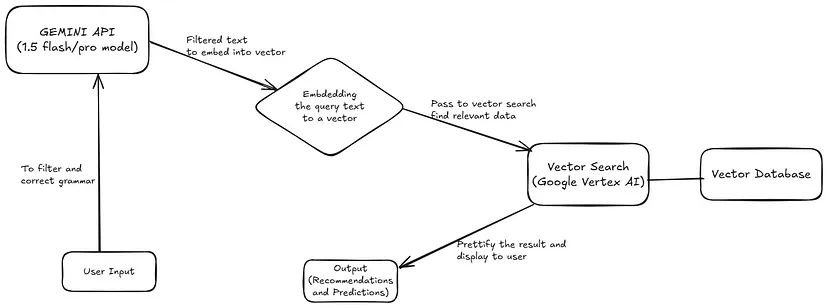
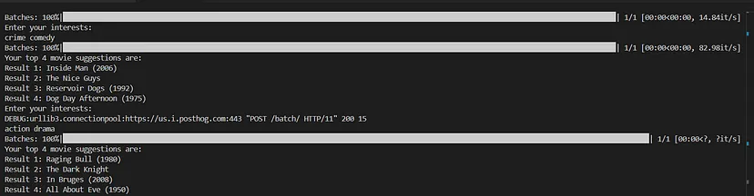
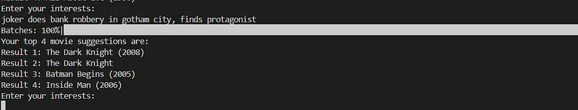
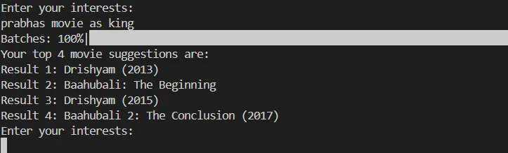

# Movie Recommentation and Finding System using GenAI and Vector Search


# Movie Prediction and Recommendation System Using Gemini API and Google Cloud Vector Search
## Introduction

In this blog, we will build a movie recommendation system using Google Cloud Vector Search and the Gemini API. This application allows users to input their interests in movies, plots, or cast & crew, and receive suggestions for binge-watching. The recommendations are based on the data trained for vector search from the IMDB dataset. Users can also input a plot or scene description to find similar movies containing the context.

## Prerequisites

- Google Cloud account
- Basic understanding of Vector Databases
- Understanding of Vector Search
- Knowledge of Python and its installation

## High-Level Architecture for the Model

### Components Explained:

- **Gemini API (1.5 Flash Model)**: Used to filter out relevant information, correct spelling and grammar errors, and prepare queries for embedding into vectors.
- **Embedding**: The process of converting text into a vector (numerical array). Vectors are used for storing and searching in the vector database.
- **Vector Search**: A method to find the most similar records (nearest data points of vectors) from a database collection.
- **Vector Database**: Works with the vector search model to easily augment and retrieve relevant data.

If you are new to vector databases, refer to this [Google Cloud guide](https://cloud.google.com/discover/what-is-a-vector-database).

**TL;DR**: Vector databases are different from traditional databases. Instead of searching for exact matches, vector databases store all data as vectors and find the nearest or most similar vectors for any given query.

## Step 1: Understand the Project Requirements

### Key Features:

- User input processing (filtering and grammar correction).
- Embedding generation (vectorization of input).
- Vector database integration for storing and retrieving embeddings.
- Search and recommendation engine (e.g., Google Vertex AI or similar).

## Step 2: Hands-On Coding

### Setting Up the Project

1. **Create a new folder and set up a virtual environment in Python.**
2. **Install necessary libraries** like `google-generativeai` and `sentence_transformers`.
3. **Create a Python script (app.py)** to start the coding process.

### Extract Data from the Dataset and Fit it into the Vector Database

```python
import google.generativeai as genai
import textwrap

# function for embedding data into the database
def call_gemini(prompt: str):
    genai.configure(api_key=API_KEY)
    production_obj = genai.protos.Schema(
        type=genai.protos.Type.OBJECT,
        properties={
            'music':  genai.protos.Schema(
                type=genai.protos.Type.ARRAY,
                items=genai.protos.Schema(type=genai.protos.Type.STRING)),
            'production_house':  genai.protos.Schema(
                type=genai.protos.Type.ARRAY,
                items=genai.protos.Schema(type=genai.protos.Type.STRING))
        }
    )

    movie_object = genai.protos.FunctionDeclaration(
        name='get_json_from_data_set',
        description=textwrap.dedent("""\
            Extracts Json data from the Movie Database
            """),
        parameters=genai.protos.Schema(
            type=genai.protos.Type.OBJECT,
            properties={
                'id': genai.protos.Schema(type=genai.protos.Type.STRING, description="The unique id of the Movie"),
                'name': genai.protos.Schema(type=genai.protos.Type.STRING, description="The name of the Movie from the given source string"),
                'plot': genai.protos.Schema(type=genai.protos.Type.STRING, description="Plot of the Movie from the given source string"),
                'genres': genai.protos.Schema(
                    type=genai.protos.Type.ARRAY,
                    items=genai.protos.Schema(type=genai.protos.Type.STRING, description="The list of genres of the Movie from the given source string")),
                'cast': genai.protos.Schema(
                    type=genai.protos.Type.ARRAY,
                    items=genai.protos.Schema(type=genai.protos.Type.STRING, description="The list of cast acted in the movie from the given source string")),
                'directors': genai.protos.Schema(
                    type=genai.protos.Type.ARRAY,
                    items=genai.protos.Schema(type=genai.protos.Type.STRING, description="The list of directors of the movie from the given source string")),
                'production': genai.protos.Schema(
                    type=genai.protos.Type.ARRAY,
                    items=production_obj),
                'release_year': genai.protos.Schema(type=genai.protos.Type.STRING)
            },
            required=['id', 'name', 'plot', 'genres', 'cast',
                      'directors', 'production', 'release_year']
        )
    )
    model = genai.GenerativeModel(
        model_name='models/gemini-1.5-flash',
        tools=[movie_object])
    response = model.generate_content(f"""
        Please add id, name, plot, genre, cast, director, production, release_date from this formatted source string to the object,
        Here are few things to take into account, don't summarize the plot and just filter out original plot text, please remove special characters, comments, newline characters, and brackets:
        {prompt}
        """)

    return response
    ```
# Movie Recommendation System Using Gemini API and Google Cloud Vector Search

## Refining the User Input

To ensure better results during vector search, the user input is refined to correct grammar while maintaining the original meaning.

### Python Code

```
# Refining the user input for better search results
```
def refine_user_prompt(prompt: str):
    genai.configure(api_key=API_KEY)
    model = genai.GenerativeModel(model_name='models/gemini-1.5-flash')
    response = model.generate_content(f"""
        Refine this prompt for vector search, don't change the meaning, correct grammar
        {prompt}
        """)
    return response.text
```

# Step 3: Setting up Google Cloud Project environment

- Install the gcloud dependency by following: https://cloud.google.com/vertex-ai/docs/vector-search/quickstart
- Replace the PROJECT_ID with your google cloud project id, Replace the json with your dataset json file. Here we will be using Kaggle and Wikipedia dataset. Please find the dataset in the GitHub repository below.

# User Input Processing and Movie Suggestions Workflow

## Steps:
1. **Refine User Input**  
   Call the function `refine_user_prompt()` to clean and process the user input text.

2. **Embed the Query**  
   Use encoding to generate embeddings for the refined query.

3. **Search for Movies**  
   Retrieve the top 3 or 5 movie suggestions based on the encoded query.

4. **Display Suggestions**  
   Display the movie suggestions in the output.


# Result





### You can also go to further to deploy the application into cloud run function in google cloud, and use it in your frontend.
### GitHub Repository for this code: https://github.com/Rajeshds20/movie-recommendation-prediction-model
